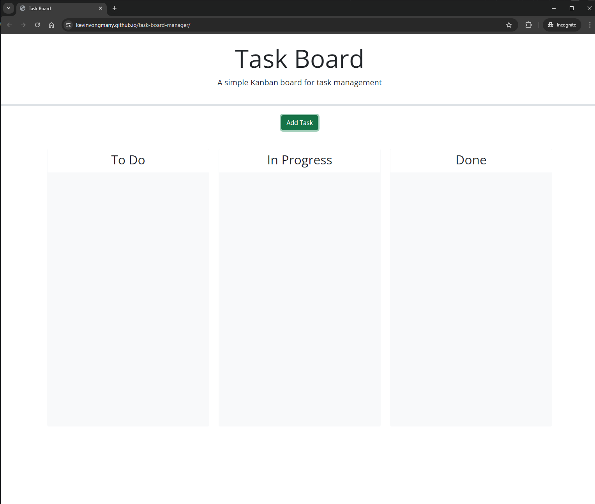

# Task Board

Within this repository is the source code for a Kanban style task board web application. Within this web page, a user will allow be able add and manage their upcoming tasks into predefined categories. This application was built using HTML, CSS & JavaScript with various 3rd party integrated APIs.

## Features

Within this web application, a user can add in tasks with the following details:
- Title
- Description
- Due date

These tasks will be rendered as 'card' elements that can be sorted into the following 3 swim lanes, each representing their own category:
1. To Do
2. In Progress
3. Done

Users will be able to drag and drop the card elements as they desire into any of the swim lanes.
This application will also warn users with a yellow card if there is a task due within 3 days or a red card if the task is overdue or due within the same day.

## External Resources
This application uses a wide array of 3rd party web-driven APIs. See below for the official documentation and GitHub repositories for the resources used within this project.
|API|Documentation|Repository|
|---|---|---|
|[Bootstrap 5.1.3](https://getbootstrap.com/)|[Docs](https://getbootstrap.com/docs/5.1/getting-started/introduction/)|https://github.com/twbs/bootstrap|
|[FontAwesome 5.8.1](https://fontawesome.com/)|[Docs](https://docs.fontawesome.com/)|https://github.com/FortAwesome/Font-Awesome|
|[jQuery 3.4.1](https://jquery.com/)|[Docs](https://api.jquery.com/)|https://github.com/jquery/jquery|
|[jQuery UI 1.13.1](https://jqueryui.com/) | [Docs](https://api.jqueryui.com/)|https://github.com/jquery/jquery-ui|
|[Day.js 1.11.3](https://day.js.org/en/) | [Docs](https://day.js.org/docs/en/installation/browser)|https://github.com/iamkun/dayjs/|

## Deploy
This repository contains the source code for the webpage, written in HTML, CSS and JavaScript and various 3rd party APIs. The final rendered webpage can be located at https://kevinvongmany.github.io/task-board-manager/.

Additionally users can access the source code in the final webpage by pressing F12, CTRL+SHIFT+I (Windows) or CMD+SHIFT+I (MacOS) on any Chrome/Firefox browsers (or any Chromium driven browser). Alternatively modern web browsers can access the source code through the context menu (right-click) -> View page source.

## Samples
Samples of the task board application can seen below:

### Task Board
#### Empty


## User Story

```md
AS A project team member with multiple tasks to organize
I WANT a task board 
SO THAT I can add individual project tasks, manage their state of progress and track overall project progress accordingly
```

## Acceptance Criteria

```md
GIVEN a task board to manage a project
WHEN I open the task board
THEN the list of project tasks is displayed in columns representing the task progress state (Not Yet Started, In Progress, Completed)
WHEN I view the task board for the project
THEN each task is color coded to indicate whether it is nearing the deadline (yellow) or is overdue (red)
WHEN I click on the button to define a new task
THEN I can enter the title, description and deadline date for the new task into a modal dialog
WHEN I click the save button for that task
THEN the properties for that task are saved in localStorage
WHEN I drag a task to a different progress column
THEN the task's progress state is updated accordingly and will stay in the new column after refreshing
WHEN I click the delete button for a task
THEN the task is removed from the task board and will not be added back after refreshing
WHEN I refresh the page
THEN the saved tasks persist
```